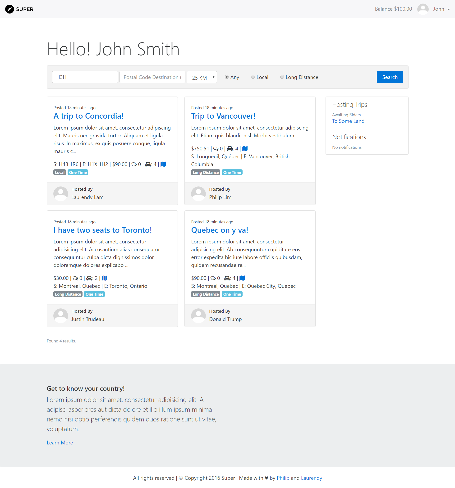

# Project Everest/Super

### How to setup environment

There are a few steps to get it up and running.

1. Setup environment file (.env): `composer run post-root-package-install` or `cp .env.example .env`
2. Generate salt: `php artisan key:generate`
3. Install packages: `composer install` `npm install`
4. Build vendor files: `gulp`
5. Migrate & seed database: `php artisan migrate --seed`
6. Run server: `php artisan serve`

### Documentation

You can consult the official documentation at [Google Docs](https://docs.google.com/document/d/1wN1vhAaDKODeMOrYpsuuuIzYeghKnl196MapjTFcPw0/edit?usp=sharing) and the [Github Wiki](https://github.com/ghiobi/Everest-353/wiki) for more project info.
